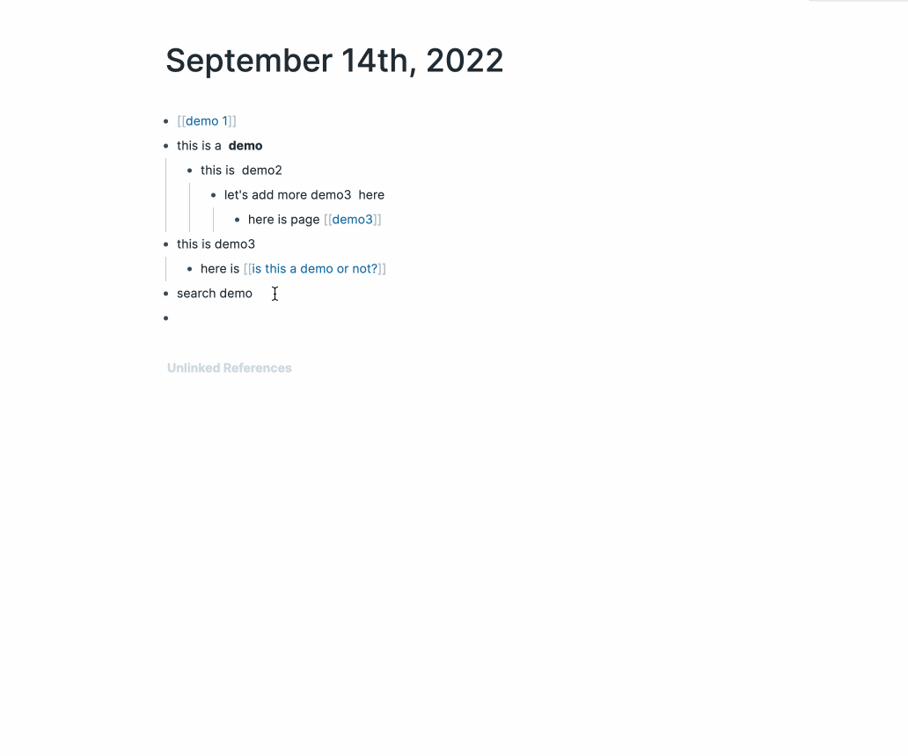

# Roam toolbar 

## search by selection



## smartblocks

1. open config
2. 


**for now, only works with custom smartblocks**


## style selection


## reference transforms


## block transforms


# changelog

- support search blocks and pages base on selection 
- support smartblocks 
- support selection style transforms

# use by [[roam/js]]

```js
    var existing = document.getElementById("roam-toolbar");
    if (!existing) {
    var extension = document.createElement("script");
        extension.src = "https://unpkg.com/@dive2pro/roam-toolbar@0.0.2/build/main.js";
        extension.id = "roam-toolbar";
        extension.async = true;
        extension.type = "text/javascript";
        document.getElementsByTagName("head")[0].appendChild(extension);
    }
```